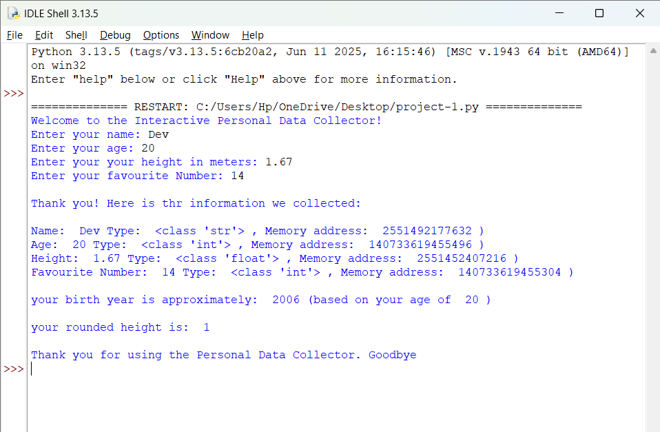

# 👤 Interactive Personal Data Collector (Python)

> A beginner-friendly Python console application that collects user information, demonstrates Python data types, memory addresses, simple calculations, and formatted output.

## ✨ Features
- 📝 Accepts user name, age, height, and favourite number.
- 🔢 Demonstrates `str`, `int`, and `float` data types.
- 🧠 Displays Python object memory addresses using `id()`.
- 🎂 Calculates approximate birth year.
- 📏 Rounds height to an integer.
- 💻 Clean terminal interaction.

## 📂 Project Structure
```text
Data Collector project/
├── project-1.py
├── output.png
└── README.md
```

## 🔄 Flowchart

```text
 Start
   │
   ▼
Display Welcome
   │
   ▼
Input Name, Age,
Height & Favourite Number
   │
   ▼
Display Values +
Type + Memory Address
   │
   ▼
Calculate Birth Year
   │
   ▼
Round Height
   │
   ▼
Display Results
   │
   ▼
   End
```

## 📸 Project Showcase

### Console Output




## 🚀 How to Run
## 🚀 How to Run

1. Download or clone this repository to your computer.

2. Open the project folder.

3. Make sure Python 3.x is installed on your system.

4. Open the `project-1.py` file in IDLE, VS Code, or any Python IDE.

5. Run the program:
   - **In IDLE:** Press **F5** or click **Run → Run Module**.
   - **In VS Code/Terminal:**
     ```bash
     python project-1.py
     ```

6. Enter the required details when prompted:
   - Name
   - Age
   - Height (in meters)
   - Favourite Number

7. The program will display:
   - User information
   - Data types (`str`, `int`, `float`)
   - Memory addresses using `id()`
   - Approximate birth year
   - Rounded height

## 🛠️ Technologies
- Python 3.13
- IDLE

## 📚 Concepts Used
- Variables
- User Input
- Type Casting
- Data Types
- `type()`
- `id()`
- Arithmetic Operations
- Formatted Output

## 🎯 Sample Output
- Collects user details
- Displays data types and memory addresses
- Estimates birth year
- Shows rounded height

## 👨‍💻 Author
**Dev Gajdhar**  
Artificial Intelligence Engineering Student

⭐ If you found this project useful, consider giving it a star!
